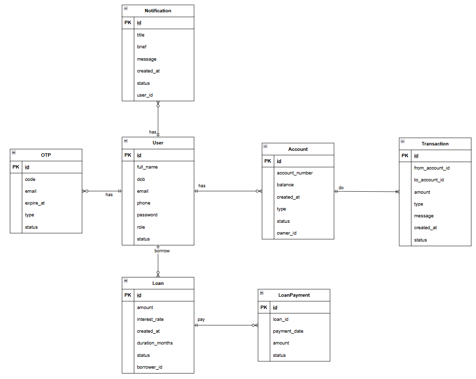

# 🏦 Mini Banking System (Spring Boot & OracleDB)

[](https://github.com/QuyDang1108/Mini-Banking-System/actions/workflows/ci-pipeline.yml)
[](https://sonarcloud.io/summary/new_code?id=QuyDang1108_Mini-Banking-System)
[](https://sonarcloud.io/summary/new_code?id=QuyDang1108_Mini-Banking-System)
[](https://sonarcloud.io/summary/new_code?id=QuyDang1108_Mini-Banking-System)
[](https://sonarcloud.io/summary/new_code?id=QuyDang1108_Mini-Banking-System)
[](https://sonarcloud.io/summary/new_code?id=QuyDang1108_Mini-Banking-System)
[](https://sonarcloud.io/summary/new_code?id=QuyDang1108_Mini-Banking-System)
[](https://sonarcloud.io/summary/new_code?id=QuyDang1108_Mini-Banking-System)
[](https://opensource.org/licenses/MIT)
---

## Giới thiệu

**Mini Banking System** là một dự án mô phỏng hệ thống ngân hàng full-stack, tập trung vào các nghiệp vụ thực tế như
quản lý tài khoản, chuyển tiền, vay vốn và phát hiện gian lận, được xây dựng trên nền tảng Spring Boot và Oracle
Database.

Dự án được thiết kế nhằm thể hiện khả năng xây dựng, quản lý và triển khai một ứng dụng Enterprise Java hoàn chỉnh — bao
gồm từ tầng nghiệp vụ, bảo mật, cơ sở dữ liệu, đến DevOps.

Hệ thống không chỉ dừng ở chức năng giao dịch cơ bản mà còn mở rộng với các phân hệ chuyên sâu như quản lý khoản vay, sổ
tiết kiệm, phát hiện gian lận, ghi log – audit, và hệ thống thông báo. Mỗi phân hệ được triển khai theo hướng
Domain-Driven Design (DDD), đảm bảo khả năng mở rộng, bảo trì và dễ dàng chuyển đổi sang microservice trong tương lai.

---

### 📚 Mục lục Tổng quan

1. [Giới thiệu](#giới-thiệu)
2. [Tính năng chính](#tính-năng-chính)
3. [Công nghệ sử dụng](#công-nghệ-sử-dụng)
4. [Cài đặt & Khởi chạy](#cài-đặt--khởi-chạy)
5. [Tài liệu API](#tài-liệu-api)
6. [Kiểm thử & Chất lượng mã](#unit-test--coverage-jacoco)
7. [CI/CD Pipeline](#cicd-pipeline-github-actions)
8. [Cấu trúc dự án](#cấu-trúc-thư-mục-project-structure)
9. [Tác giả & Giấy phép](#tác-giả)

---

## 🚀 Tính năng chính (Key Features)

Dự án là một hệ thống Mini-Banking Core API, mô phỏng các nghiệp vụ tài chính phức tạp, tập trung vào bảo mật, tính toàn
vẹn dữ liệu (ACID) và xử lý đồng thời.

### 🧑‍💻 Nghiệp vụ Khách hàng (User Features)

* **Xác thực & Bảo mật:**
    * Đăng ký, Đăng nhập và Quản lý phiên (JWT Access/Refresh Token).
    * Xác thực hai bước qua OTP (gửi bất đồng bộ qua Spring Mail).
    * Bảo mật mật khẩu (Bcrypt) và các quy trình (Quên mật khẩu, Đổi mật khẩu).
* **Quản lý Tài khoản (Account Management):**
    * Quản lý đa tài khoản (Thanh toán, Tiết kiệm).
    * Xem thông tin cá nhân, số dư và chi tiết tài khoản.
* **Giao dịch & Chuyển tiền (Transactions):**
    * **(Nâng cao)** Chuyển khoản nội bộ: Xử lý với độ tin cậy cao, sử dụng `Transaction` (ACID) và
      `Pessimistic Locking` (SELECT...FOR UPDATE) để chống race-condition, đảm bảo số dư không bao giờ âm.
    * Xem lịch sử giao dịch (có phân trang).
* **Sản phẩm Tiền gửi (Savings):**
    * **(Nâng cao)** Mở Sổ Tiết kiệm: Nghiệp vụ `Transaction` tự động trích tiền từ tài khoản chính để mở sổ mới.
    * **(Nâng cao)** Tất toán Sổ Tiết kiệm: Nghiệp vụ `Transaction` tự động tính lãi (mô phỏng) và cộng dồn (gốc + lãi)
      về tài khoản chính khi đóng sổ.
* **Sản phẩm Tín dụng (Loan):**
    * Nộp đơn đăng ký khoản vay.
    * Theo dõi lịch sử và chi tiết khoản vay.
    * **(Nâng cao)** Thanh toán nợ: Xử lý thanh toán hàng tháng qua `Transaction`, cập nhật số dư nợ và ghi log
      `LoanPayment`.
* **Hệ thống Thông báo (Notifications):**
    * Nhận thông báo (biến động số dư, nhắc nợ, OTP...).
    * Đánh dấu đã đọc và xem số lượng thông báo chưa đọc.

### 🧑‍💼 Nghiệp vụ Quản trị (Admin Features)

* **Quản lý Người dùng:**
    * Quản lý tập trung (tìm kiếm, phân trang).
    * Thực hiện các hành động: Khóa / Mở khóa tài khoản người dùng.
* **Quản lý Tín dụng (Loan Approval):**
    * Theo dõi và lọc các đơn vay theo trạng thái (PENDING, APPROVED, REJECTED).
    * Duyệt / Từ chối khoản vay.
    * **(Nâng cao)** Giải ngân: Kích hoạt `Transaction` tự động cập nhật trạng thái `Loan` và chuyển tiền vào tài khoản
      người dùng khi được duyệt.
* **Giám sát & Rủi ro (System Monitoring):**
    * **(Nâng cao)** Giám sát giao dịch: Tự động "gắn cờ" (flag) các giao dịch bất thường (VD: số tiền lớn) và đưa vào
      hàng đợi `PENDING_REVIEW`.
    * **(Nâng cao)** Review thủ công: Admin review và (Duyệt / Từ chối) các giao dịch bị gắn cờ.
    * Truy vết (Audit Log): Xem log ghi lại toàn bộ các hành động nhạy cảm của Admin (ai đã duyệt vay, khi nào, ai đã
      khóa user).

### ⚙️ Hệ thống & Kỹ thuật (Backend & System)

* **Tác vụ Tự động (Scheduled Jobs/Cron):**
    * Tự động dọn dẹp dữ liệu rác (OTP, thông báo cũ).
    * Tự động gửi email nhắc nợ khi đến hạn.
    * **(Nâng cao)** Tự động quét và cập nhật trạng thái Nợ Quá Hạn (OVERDUE) cho các khoản vay (sử dụng Stored
      Procedure).
    * **(Nâng cao)** Tự động tính và cộng lãi tiết kiệm định kỳ hàng tháng (sử dụng Cursor và Transaction).
* **Kỹ thuật Nâng cao (Advanced Tech):**
    * Thông báo Real-time (WebSocket): Cấu hình server WebSocket (STOMP) để đẩy thông báo (VD: "Bạn vừa nhận được tiền")
      ngay lập tức về client.
    * Tập trung vào Database: Sử dụng mạnh mẽ Stored Procedures và Transactions để đảm bảo tính toàn vẹn dữ liệu (ACID)
      cho mọi nghiệp vụ tài chính.

---

## ⚙️ Công nghệ sử dụng (Technology Stack)

| Hạng mục               | Công nghệ                                                             |
|:-----------------------|:----------------------------------------------------------------------|
| **Backend Core**       | Spring Boot 3.5.6, Spring Security (JWT), Spring Data JPA (Hibernate) |
| **Database**           | Oracle Database (RDBMS)                                               |
| **Async & Scheduling** | Spring Mail, `@Async`, Spring Scheduler (Cron Jobs)                   |
| **API & Development**  | Lombok, Swagger / OpenAPI 3                                           |
| **Testing**            | JUnit 5, Mockito                                                      |
| **Code Quality**       | JaCoCo (Code Coverage), Checkstyle (Google Java Convention)           |
| **Static Analysis**    | SonarQube                                                             |
| **Security Scanning**  | GitLeaks                                                              |
| **DevOps (CI/CD)**     | GitHub Actions, Docker, Docker Compose                                |

---

## 🧮 Mô hình Cơ sở dữ liệu (Database Schema)


---

## 🔐 Phân quyền người dùng (Roles & Permissions)

Hệ thống định nghĩa các vai trò (roles) sau để kiểm soát truy cập:

| Role         | Quyền hạn (Permissions)                                                 |
|:-------------|:------------------------------------------------------------------------|
| **ADMIN**    | Quản lý user, duyệt/từ chối khoản vay, giải ngân, xem audit log.        |
| **CUSTOMER** | Giao dịch (chuyển tiền, tiết kiệm), quản lý tài khoản, đăng ký vay vốn. |
| **ANALYST**  | Theo dõi log, giám sát giao dịch và báo cáo gian lận (read-only).       |
| **SYSTEM**   | Vai trò nội bộ, thực hiện các tác vụ tự động (scheduler, notification). |

---

## 🚀 Cài đặt & Chạy dự án (Getting Started)

### Yêu cầu tiên quyết (Prerequisites)

* [Java JDK (phiên bản 17+)](https://download.oracle.com/java/17/archive/jdk-17.0.12_windows-x64_bin.zip)
* [Apache Maven]()
* [Docker](https://www.docker.com/get-started) và [Docker Compose]()
* (Tùy chọn) [SonarQube](https://www.sonarqube.org/downloads/) (để chạy phân tích cục bộ)
* (Tùy chọn) [GitLeaks](https://github.com/gitleaks/gitleaks) (để quét bảo mật cục bộ)

### Hướng dẫn cài đặt

1. **Clone repository:**
   ```bash
   git clone [https://github.com/QuyDang1108/mini-banking-system.git](https://github.com/QuyDang1108/mini-banking-system.git)
   cd mini-banking-system
   ```

2. **Chạy bằng Docker Compose:**
   Đây là cách nhanh nhất để khởi chạy toàn bộ hệ thống, bao gồm ứng dụng Spring Boot và Oracle Database đã được cấu
   hình sẵn.

   ```bash
   docker-compose up -d --build
   ```

   Ứng dụng sẽ chạy tại `http://localhost:8080`.

---

## 📚 Tài liệu API (API Documentation)

Sau khi khởi chạy ứng dụng, tài liệu API (Swagger UI) sẽ có sẵn tại:

http://localhost:8080/swagger-ui.html

---

## 🧪 Kiểm thử & Chất lượng mã (Testing & Code Quality)

Dự án được cấu hình với nhiều công cụ để đảm bảo chất lượng và bảo mật.

### 🧪 Unit Test & Coverage (JaCoCo)

Thực thi Unit Test và tạo báo cáo độ bao phủ mã (Code Coverage).
**Mục tiêu:** Đảm bảo độ bao phủ > **70%** để duy trì chất lượng mã ổn định.

```bash
# Chạy Unit Tests
mvn test

# Tạo báo cáo JaCoCo
mvn jacoco:report
```

Báo cáo sẽ được tạo tại:
`target/site/jacoco/index.html`

---

### 💅 Code Style (Checkstyle)

Dự án tuân thủ **Google Java Coding Convention**, được định nghĩa tại tệp:
`config/checkstyle/checkstyle.xml`

```bash
# Kiểm tra code style
mvn checkstyle:checkstyle
```

Công cụ Checkstyle đảm bảo mã nguồn tuân theo quy tắc định dạng, giúp dễ đọc và nhất quán.

---

### 🧩 Phân tích Tĩnh (SonarQube)

Phân tích mã để phát hiện:

* **Bugs** (lỗi logic)
* **Vulnerabilities** (lỗ hổng bảo mật)
* **Code Smells** (mã khó bảo trì)

```bash
# Yêu cầu SonarQube server đang chạy tại http://localhost:9000
mvn sonar:sonar \
  -Dsonar.host.url=http://localhost:9000 \
  -Dsonar.login=<your-sonarqube-token>
```

Kết quả sẽ được hiển thị trên **SonarQube Dashboard**, bao gồm các chỉ số về chất lượng, độ bao phủ và độ phức tạp.

---

### 🔒 Quét Bảo mật (GitLeaks)

Công cụ **GitLeaks** được sử dụng để phát hiện và ngăn chặn rò rỉ thông tin nhạy cảm (như API keys, credentials).

```bash
# Quét toàn bộ repository
gitleaks detect --source .
```

Báo cáo sẽ hiển thị các phát hiện tiềm ẩn, giúp đảm bảo an toàn trước khi mã được đẩy lên repository công khai.

---

### 🧱 CI/CD Pipeline (GitHub Actions)

Hệ thống CI/CD được tự động hóa thông qua **GitHub Actions**, định nghĩa tại:
`.github/workflows/ci-pipeline.yml`

Pipeline sẽ **tự động kích hoạt** khi có **push** hoặc **pull request**, bao gồm các giai đoạn sau:

| Giai đoạn              | Mô tả                                                   |
|------------------------|---------------------------------------------------------|
| **Checkstyle**         | Kiểm tra code style và định dạng theo Google Convention |
| **Build & Test**       | Biên dịch mã và chạy toàn bộ Unit Tests                 |
| **JaCoCo Report**      | Sinh báo cáo độ bao phủ mã                              |
| **SonarQube Analysis** | Phân tích chất lượng và bảo mật mã nguồn                |
| **GitLeaks Scan**      | Quét phát hiện thông tin nhạy cảm                       |

---

### 📂 Cấu trúc Thư mục (Project Structure)

```
src/
└── main/java/com/us/minibankingproject/
    ├── configuration/   → Cấu hình hệ thống (Security, Swagger, Mail, Async)
    ├── controllers/     → REST API Endpoints
    ├── dtos/            → Data Transfer Objects
    ├── entities/        → JPA Entities (bảng cơ sở dữ liệu)
    ├── enums/           → Các hằng số, vai trò, trạng thái
    ├── exceptions/      → Xử lý ngoại lệ toàn cục
    ├── repositories/    → Spring Data JPA repositories
    ├── services/        → Logic nghiệp vụ
    │    └── impl/       → Triển khai cụ thể của service
    └── utils/           → Các lớp tiện ích (Utility classes)
```

---

### 👨‍💻 Tác giả

**Đặng Quý (QuyDang1108)**

🔗 GitHub: [github.com/QuyDang1108](https://github.com/QuyDang1108)

---

### 📄 Giấy phép (License)

Dự án này được phát hành theo **Giấy phép MIT (MIT License)**.
Vui lòng xem tệp [LICENSE](LICENSE) để biết thêm chi tiết.

---
